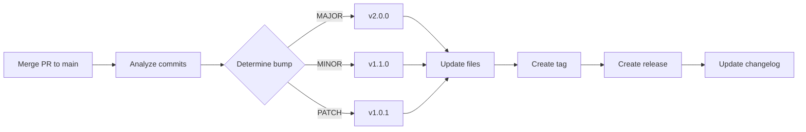

# Versioning Guide

This document explains how versioning works in the FPL Companion project.

---

## 📦 Current Version: **v2.0.0**

---

## Overview

FPL Companion uses **automated semantic versioning** based on commit messages. When you merge to `main`, the system automatically:

1. ✅ Analyzes commit messages
2. ✅ Determines version bump type
3. ✅ Updates all `package.json` files
4. ✅ Creates a Git tag
5. ✅ Generates GitHub release
6. ✅ Updates CHANGELOG.md

**No manual versioning required!** 🎉

---

## 🔢 Semantic Versioning

We follow [Semantic Versioning 2.0.0](https://semver.org/):

```
MAJOR.MINOR.PATCH
  2  .  0  .  0
```

### Version Components

| Component | When to Bump | Example |
|-----------|-------------|---------|
| **MAJOR** | Breaking changes | API changes, removed features |
| **MINOR** | New features (backward-compatible) | New endpoints, new UI |
| **PATCH** | Bug fixes & minor updates | Fixes, docs, refactors |

---

## 🎯 How It Works

### Commit Message → Version Bump

Your commit messages control the version:

#### MAJOR Bump (Breaking Changes)

```bash
# Using ! suffix
feat!: remove old API endpoint

# Using BREAKING CHANGE footer
feat: redesign API response

BREAKING CHANGE: The response structure has changed

# Using breaking keyword
breaking: change database schema
```

**Result:** `v1.0.0` → `v2.0.0`

#### MINOR Bump (New Features)

```bash
feat: add live points tracking
feat(backend): implement team comparison
feature: create pitch view component
```

**Result:** `v1.0.0` → `v1.1.0`

#### PATCH Bump (Fixes & Updates)

```bash
fix: correct points calculation
fix(ui): resolve layout issue
chore: update dependencies
docs: improve README
refactor: optimize cache logic
perf: improve API speed
test: add unit tests
```

**Result:** `v1.0.0` → `v1.0.1`

#### No Bump

```bash
chore: update gitignore [skip ci]
ci: modify GitHub Actions
```

**Result:** No version change

---

## 🔄 Automated Workflow

### What Happens on Merge to Main



### Step-by-Step

1. **You merge** a PR to `main`
2. **GitHub Actions** runs the release workflow
3. **Commits analyzed** since last tag
4. **Highest bump wins:**
   - If any commit is MAJOR → MAJOR bump
   - Else if any is MINOR → MINOR bump
   - Else if any is PATCH → PATCH bump
   - Else → No bump
5. **Files updated:**
   - `package.json` (root)
   - `backend/package.json`
   - `frontend/package.json`
   - `CHANGELOG.md`
6. **Git tag created:** `v2.0.0`
7. **GitHub release created** with notes
8. **Changes committed** back to `main`

---

## 📝 Commit Message Format

### Structure

```
<type>(<scope>): <subject>

<body>

<footer>
```

### Types Reference

| Type | Bump | Description |
|------|------|-------------|
| `feat` | MINOR | New feature |
| `feat!` | MAJOR | Breaking feature |
| `fix` | PATCH | Bug fix |
| `chore` | PATCH | Maintenance |
| `docs` | PATCH | Documentation |
| `style` | PATCH | Code style |
| `refactor` | PATCH | Code refactoring |
| `perf` | PATCH | Performance |
| `test` | PATCH | Testing |
| `breaking` | MAJOR | Breaking change |

### Examples

#### ✅ Good Examples

```bash
# MAJOR bump - Breaking change
feat!: redesign API response structure

BREAKING CHANGE: All endpoints now return data in a new format.
See migration guide in docs/migration.md

# MINOR bump - New feature
feat(backend): add real-time live points tracking

Implements live point calculation with captain multiplier
and fixture information per player.

Closes #15

# PATCH bump - Bug fix
fix(frontend): correct captain points display

Captain multiplier was not being applied correctly
in the LivePointsView component.

Fixes #23

# PATCH bump - Documentation
docs: add versioning guide

# No bump - CI change
ci: update GitHub Actions workflow [skip ci]
```

#### ❌ Bad Examples

```bash
# Too vague
update stuff

# Missing type
add new feature

# Wrong type for breaking change
feat: remove old endpoint
# Should be: feat!: remove old endpoint
```

---

## 🎨 Scopes (Optional)

Add scopes to provide context:

```bash
feat(backend): add new endpoint
fix(frontend): resolve UI bug
docs(api): update endpoint docs
chore(docker): optimize builds
```

**Common scopes:**
- `backend` - Backend changes
- `frontend` - Frontend changes
- `api` - API-specific
- `ui` - UI/UX changes
- `docker` - Docker/deployment
- `docs` - Documentation

---

## 🏷️ Tags and Releases

### Git Tags

Every version creates a Git tag:

```bash
# List all tags
git tag

# Checkout specific version
git checkout v2.0.0

# View tag details
git show v2.0.0
```

### GitHub Releases

Each version creates a GitHub Release at:
```
https://github.com/AndrewTtofi/fplcompanion/releases
```

**Release includes:**
- Version number
- Release date
- Changelog
- Commit list
- Downloadable assets

---

## 📖 CHANGELOG.md

The changelog is automatically updated with:

```markdown
## [2.0.0] - 2026-01-17

### Changes
- feat(backend): add live points tracking (a1b2c3d)
- feat(frontend): implement team comparison (d4e5f6g)
- fix(ui): correct responsive layout (h7i8j9k)
```

See [CHANGELOG.md](CHANGELOG.md) for full version history.

---

## 🛠️ Manual Override

### Skip Versioning

Add `[skip ci]` to commit message:

```bash
git commit -m "chore: update gitignore [skip ci]"
```

### Force Specific Version

Not recommended, but possible:

```bash
# Manually create tag
git tag -a v3.0.0 -m "Force version 3.0.0"
git push origin v3.0.0
```

---

## 📊 Version History

| Version | Date | Type | Description |
|---------|------|------|-------------|
| v2.0.0 | 2026-01-17 | MAJOR | Live points, comparison, enhanced pitch view |
| v1.0.0 | 2026-01-17 | INITIAL | Core application release |

See [CHANGELOG.md](CHANGELOG.md) for detailed history.

---

## 🔮 Future Versions

### Upcoming Features (Planned)

- **v2.1.0** - Transfer suggestions
- **v2.2.0** - Fixture difficulty analyzer
- **v2.3.0** - Price change tracker
- **v3.0.0** - Major UI overhaul

---

## 🤔 FAQ

### Q: How do I know what version to use in my commit?

**A:** You don't! Just write a good commit message with the right type (`feat`, `fix`, etc.). The system figures out the version automatically.

### Q: Can I create a release manually?

**A:** Yes, but not recommended. The automated system is more consistent.

### Q: What if I make a mistake in my commit message?

**A:** Before merging, you can amend or squash commits in your PR. After merging, the version is set.

### Q: How do I see all versions?

**A:** Check:
- [CHANGELOG.md](CHANGELOG.md) - Full history
- [Releases page](https://github.com/AndrewTtofi/fplcompanion/releases) - GitHub releases
- `git tag` - Local tags

### Q: What happens if multiple commits have different bump types?

**A:** The highest bump wins:
1. MAJOR (breaking)
2. MINOR (feat)
3. PATCH (fix, chore, etc.)

### Q: Can I preview the next version before merging?

**A:** The release workflow runs after merge. Review the commits in your PR to estimate the bump.

---

## 🎓 Best Practices

### DO ✅

- Use conventional commit format
- Be specific in commit messages
- Add body for complex changes
- Reference issues (`Closes #123`)
- Use scopes for clarity
- Test locally before pushing

### DON'T ❌

- Mix multiple changes in one commit
- Use vague messages ("fix stuff")
- Forget the commit type
- Skip the colon after type
- Use wrong type for breaking changes

---

## 📚 Resources

- [Conventional Commits](https://www.conventionalcommits.org/)
- [Semantic Versioning](https://semver.org/)
- [Keep a Changelog](https://keepachangelog.com/)
- [CONTRIBUTING.md](CONTRIBUTING.md)

---

## 🔗 Quick Links

- **Repository:** https://github.com/AndrewTtofi/fplcompanion
- **Releases:** https://github.com/AndrewTtofi/fplcompanion/releases
- **Changelog:** [CHANGELOG.md](CHANGELOG.md)
- **Contributing:** [CONTRIBUTING.md](CONTRIBUTING.md)

---

**Questions?** Open an issue or discussion on GitHub!
